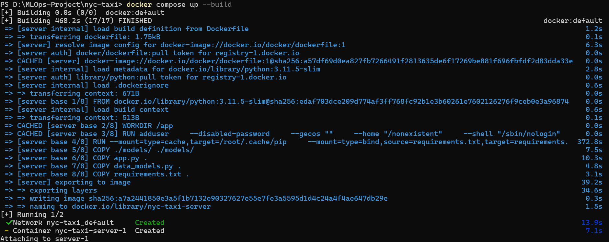

# Welcome to the Docker Demo

Download Docker Desktop from the link [download here](https://www.docker.com/products/docker-desktop/)

Once you are in project folder just type in the command

```cmd
docker init
```

The result will show something like this


> It is advised to check the DOCKERFILE before committing to the build image phase. You can check the DOCKERFILE in the project.

The next command to run is

```cmd
docker compose up --build
```


